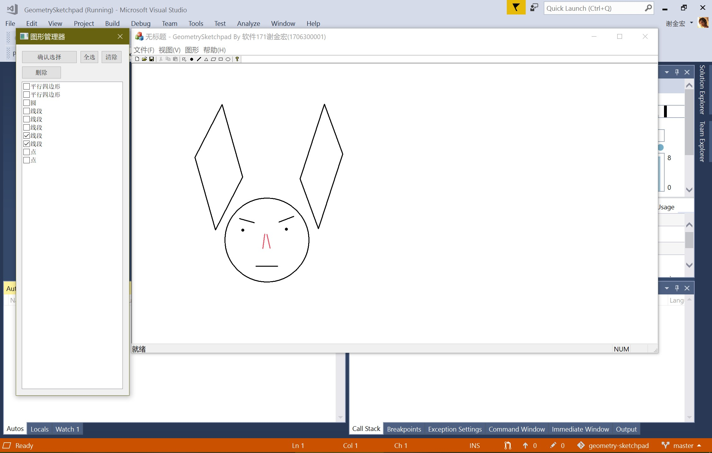

# Geometry-Sketchpad 几何画板

大二上学期面向对象程序设计的课程设计。虽然是叫做 ~~“几何画板”~~ ，但实现的功能很有限。

基本功能包括：

1. 几何图形的鼠标绘制与按坐标精确绘制。（这里坐标系有点奇特，坐标原点(0, 0)位于窗口的左上角。~~其实是因为自己没有做绘制坐标的转换~~）
2. 已绘制几何图形的选取（通过“图形管理器”窗口实现，理想状态下应该是通过鼠标直接选取图形，不过技术不足只好通过这样的途径实现这个功能）
3. 几何图形的平移和缩放（这里实现的是一种“奇异的”与正常的直觉的缩放不一样）
4. 几何图形周长和面积的计算（只能计算圆和凸多边形的面积）
5. 保存到文件与从文件中读取的功能（利用MFC串行化的机制）

如果把上面吐槽的部分都认为是Feature的话，重大的Bug应该是没有的😀。
